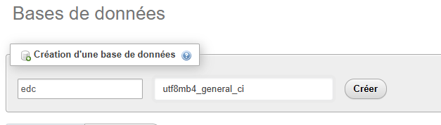

# Projet Etude de cas de fin de bloc (Iscod)

## Prérequis

- Docker
- Git

## Information importante

Dans le cadre de ce projet, le cahier des charges a explicitement informé de la non-nécessité d'avoir une sécurité accrue, car cela n'a pas encore été vu en cours.
Ce projet n'a pas non plus vocation à entrer en production et à être disponible en ligne. Si cela devait changer un jour, les dispositions de sécurité seraient mises en place.
C'est pourquoi les mots de passe d'utilisateurs en base de données ne sont pas cryptés. De la même manière, l'authentification en frontend est validée par un cookie contenant l'id de l'utilisateur connecté.

## Installation

- Ouvrir un terminal de commande.
- Lancer la commande ```git clone https://github.com/ReVolTPFE/iscod-b3-edc-spring-angular-app.git``` depuis le répertoire où vous souhaitez installer le projet.
- Lancer la commande ```cd iscod-b3-edc-spring-angular-app``` pour entrer dans le projet.
- Lancer la commande ```docker compose up --build```dans le terminal.

## Ajout de la base de données et de ses données pré-remplies
- Aller sur http://localhost:8000 et se connecter à l'interface phpMyAdmin (user = root, password = root).<br>
- Créer une base de données s'appelant "edc" et ayant un encodage "utf8mb4_general_ci" si celle-ci n'existe pas déjà.<br>
 
<br>
- En étant sur la page de la base de données, en haut de la page se situe un menu de navigation. Cliquer sur "Importer". Voir image ci-dessous.<br>
 
<br>
- Un bloc sur la page demande à ajouter le fichier que vous souhaitez importer. Choisir le fichier ```edc.sql``` présent à la racine du projet Git cloné.<br>
 
<br>
- Descendez ensuite tout en bas de la page et cliquez sur le bouton "Importer".

## Accès à l'application

- Base de données (phpMyAdmin -> user = root, password = root) : http://localhost:8000
- Backend Spring Boot (API donc pas de web configuré) : http://localhost:8080
- Frontend Angular : http://localhost:4200
- Interface mail catcher (maildev) : http://localhost:8081

## Utilisateurs du site (repris du cahier des charges)
- John Doe (CEO) :
	- email : john@codesolutions.com
	- password : azerty

- Nicolas (Product Owner) :
	- email : nicolas@codesolutions.com
	- password : azerty

- Mariana (Tech Lead) : Mariana est l'administrateur des 2 projets, c'est donc elle qui a accès à tous les privilèges et qui peut tout éditer.
	- email : mariana@codesolutions.com
	- password : azerty