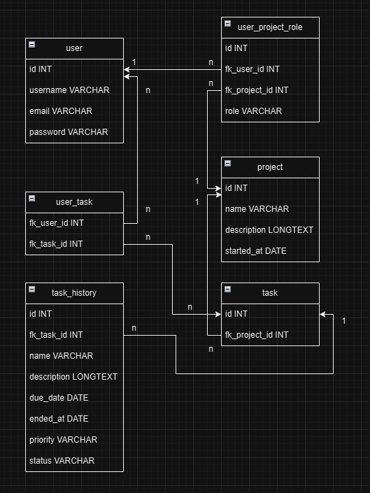
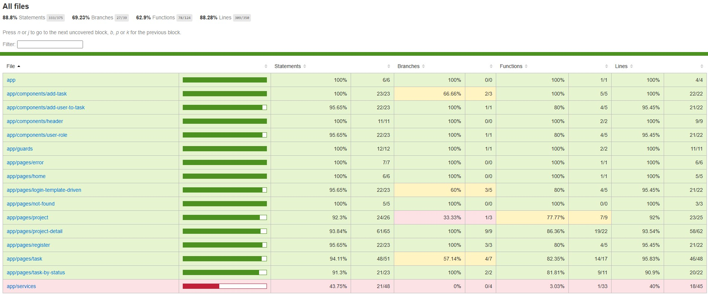
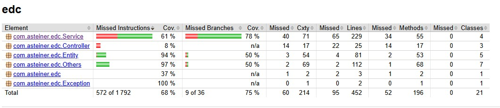

# Projet Etude de cas de fin de bloc (Iscod)

## Prérequis

- Docker
- Git

## Information importante

Dans le cadre de ce projet, le cahier des charges a explicitement informé de la non-nécessité d'avoir une sécurité accrue, car cela n'a pas encore été vu en cours.
Ce projet n'a pas non plus vocation à entrer en production et à être disponible en ligne. Si cela devait changer un jour, les dispositions de sécurité seraient mises en place.
C'est pourquoi les mots de passe d'utilisateurs en base de données ne sont pas cryptés. De la même manière, l'authentification en frontend est validée par un cookie contenant l'id de l'utilisateur connecté.

## Installation

- Ouvrir un terminal de commande.
- Lancer la commande ```git clone https://github.com/ReVolTPFE/iscod-b3-edc-spring-angular-app.git``` depuis le répertoire où vous souhaitez installer le projet.
- Lancer la commande ```cd iscod-b3-edc-spring-angular-app``` pour entrer dans le projet.
- Lancer la commande ```docker compose up --build```dans le terminal.
- Les données par défaut de la base de données sont automatiquement entrées en base de données via Docker lors du premier "build". Le site est donc directement fonctionnel avec des utilisateurs, projets et tâches déjà présents.

## Accès à l'application

- Base de données (phpMyAdmin -> user = root, password = root) : http://localhost:8000
- Backend Spring Boot (Documentation Swagger) : http://localhost:8080/swagger-ui/index.html
- Frontend Angular : http://localhost:4200
- Interface mail catcher (maildev) : http://localhost:8081

## Utilisateurs du site déjà présents (repris du cahier des charges)
- John Doe (CEO) :
	- email : john@codesolutions.com
	- password : azerty

- Nicolas (Product Owner) :
	- email : nicolas@codesolutions.com
	- password : azerty

- Mariana (Tech Lead) : Mariana est l'administrateur des 2 projets, c'est donc elle qui a accès à tous les privilèges et qui peut tout éditer.
	- email : mariana@codesolutions.com
	- password : azerty

## Schéma de la base de données (fichier disponible dans ```./readme-img/db-schema.jpg```)


## Code coverage (attendu 60% pour instructions et branches)

- Frontend (fichier disponible dans ```./readme-img/code-coverage-frontend.jpg```) :
	- Instructions : 88.8 %
	- Branches : 69.23 %
<br>


<br>

- Backend (fichier disponible dans ```./readme-img/code-coverage-backend.jpg```) :
	- Instructions : 68 %
	- Branches : 75 %
<br>


<br>

## Procédures de déploiement

Un pipeline de CI-CD est présent lors du push d'un commit sur la branche master.
Ce pipeline effectue plusieurs actions :
- Build complet du projet sous Docker
- Validation des tests unitaires et d'intégration Frontend et Backend
- Déploiement des images Frontend et Backend sur DockerHub.
	- Frontend : https://hub.docker.com/r/r3volt/iscod-b3-edc-frontend
	- Backend : https://hub.docker.com/r/r3volt/iscod-b3-edc-backend

## Récapitulatif concernant tous les livrables demandés

Livrables de la phase de conception :  
- Schéma de la base de données : ```./readme-img/db-schema.jpg```
- Script SQL de génération de la base de données (structure et données de test) : ```./edc.sql```

Livrables de la phase de développement :
- Une repository (GitHuB, Gitlab, etc.) à jour : La repository de ce README

Livrables de la phase de tests : 
- Rapport de couverture du code frontend : ```./readme-img/code-coverage-frontend.jpg```
- Rapport de couverture du code backend : ```./readme-img/code-coverage-backend.jpg```

Livrables de la phase de déploiement : 
- Fichier de configuration du pipeline CI/CD : ```./.github/workflows/ci-cd.yml```
- Dockerfile du backend : ```./backend/Dockerfile```
- Dockerfile du frontend : ```./frontend/Dockerfile```
- Fichier README.md avec la procédure de déploiement : Ce fichier README